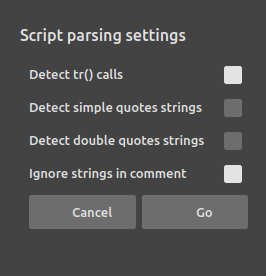

# Create a new translation

Creating a new translation is easy with DuTranslator. You just have to open a template file, which basically is an empty translation file with only the original text strings to translate.

[TOC]

This template file is usually generated by the application you have to translate itself, or provided by the developper of the application. In this case, you can directly jump to the second step. If you do not have this file, read the following section.

## 1. Generate an empty translation file.

In the case the developper of the application you want to translate does not provide the empty translation file, start by looking for a way to export this file from the application itself. If the application uses DuTF - The Duduf Translation Framework, this option should be available.

If the application does not use this framework yet, or if the option has not been implemented, you can generate this translation file directly from the source code.

Click on the right part of the *open* button, then select `Import`.

If the application has already implemented the translation framework, all strings to be translated should already be enclosed in `tr()` function calls. In this case DuTranslator will automatically generate the translation file from these strings.

If the application is not using the framework yet, or if some strings miss the function call, you can check the option to detect the other strings from the source code.

DuTranslator will create and load an empty translation file

## 2. Look for the language code of the destination language

Before starting your new translation, you have to input the language code so that *DuTranslator* and the framework can recognize the language.

*DuTranslator* uses the two-letter **ISO-639-1 language code**. [You can find the complete list here](https://en.wikipedia.org/wiki/List_of_ISO_639-1_codes). You will also need the language **native name**.

## 2. Save the empty file

Before starting the translation, save it as a new file.

Click on the right part of the *save* button and select `Save as...`.

The file has to be named after the application name followed by the underscore character `_` and the translation language code. The extension (file type) is `.json`.

Example: `Duik Bassel_zh.json` is the Chinese translation file for *Duik Bassel*.

## 3. Input the destination application, the language code and language name

In the upper right part of *DuTranslator*, next to the file name, you can input the application the translation is made for, the language code and the language native name.

You're now good to go! Just [start translating](use.md), save the file, and send it to the developper so it can be distributed with the application.
